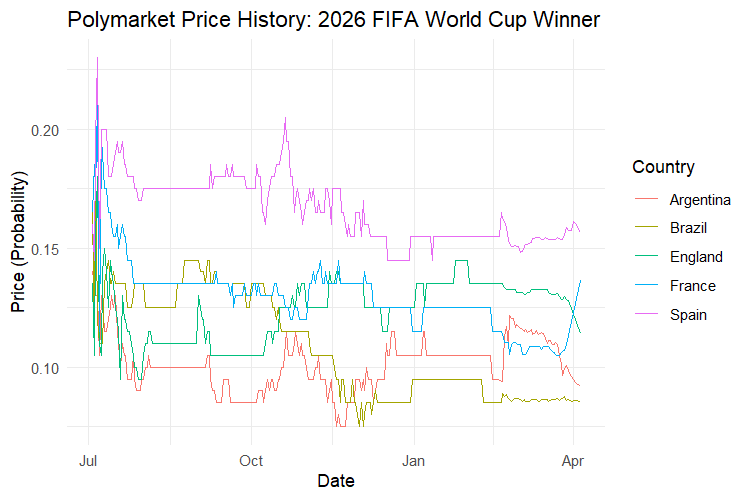

# polymarketR

An R package to access, analyze, and visualize [Polymarket](https://polymarket.com) event, market, and price data using public API endpoints.

## Installation

This package is currently in development. To install the latest version from GitHub:

```r
# Install devtools if you haven't already
install.packages("devtools")

# Install polymarketR from GitHub
devtools::install_github("clintmckenna/polymarketR")
```

## Usage Examples

```r
# Load required libraries
library(polymarketR)
library(ggplot2)

# Search for an event by text (fuzzy search)
event_results <- search_events_text("new york city mayoral election")

# Get event details by slug (use a known slug for stability)
# Suppose we want to look at the 2025 New York City mayoral election. We can get the slug from the URL on Polymarket:
# https://polymarket.com/event/new-york-city-mayoral-election
event_slug <- "new-york-city-mayoral-election"
event <- get_event_by_slug(event_slug)

# Extract all markets for the event
markets <- get_event_markets(event_slug)

# Get price history for all Yes/No tokens in the event
## Note: The interval and fidelity arguments are not always respected by the API—results may still be high-frequency.
## By default, we exclude markets with zero liquidity.
history <- get_event_prices_history(event_slug, interval = "max", fidelity = 1440)

# Plot a time series of prices for all markets and outcomes
# (Here, we facet by groupItemTitle for clarity)
ggplot(history, aes(x = datetime, y = price, color = outcome)) +
  geom_line() +
  facet_wrap(~ groupItemTitle, scales = "free_y") +
  labs(
    title = "Polymarket Price History: New York City Mayoral Election",
    x = "Date",
    y = "Price (Probability)",
    color = "Outcome"
  ) +
  theme_minimal()

```




## Recently Added Functions

```r
# Get the best bid/ask price for a token (use a token_id from markets tibble)
token <- markets$yes_token_id[1]
price <- get_price(token_id = token, side = "buy")

# Get the order book for a token (long format with bids/asks)
book <- get_book(token_id = token, side = "both")

# Get all current positions for a user
address <- "0x44c1dfe43260c94ed4f1d00de2e1f80fb113ebc1"
positions <- get_position(user = address)

# Get on-chain activity for a user (trades, splits, merges, etc.)
activity <- get_user_activity(user = address, limit = 20)

# Get top holders for a market token (by conditionId)
conId <- markets$conditionId[1]
holders <- get_holders(market = conId, limit = 10)

# Get the total USD value of a user's holdings (across all or specific markets)
user_holdings <- get_user_value(user = address)

```

**Notes:**
- Not all events/markets will have price history available for all tokens.
- The interval parameter may not always be honored exactly by the API; you may receive lower- or higher-frequency data. Still trying to figure out a solution for this.
- All package functions return tibbles for easy manipulation with dplyr/tidyverse tools.

Thanks and feel free to suggest any changes or improvements!