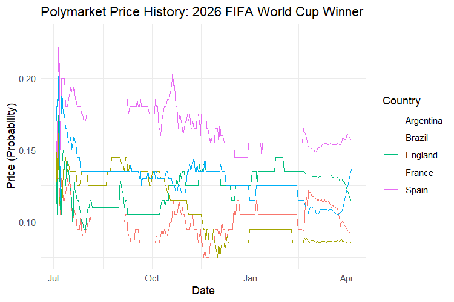

# polymarketR

An R package to access, analyze, and visualize [Polymarket](https://polymarket.com) event, market, and price data using public API endpoints.

## Installation

This package is currently in development. To install the latest version from GitHub:

```r
# Install devtools if you haven't already
install.packages("devtools")

# Install polymarketR from GitHub
devtools::install_github("clintmckenna/polymarketR")
```

## Usage Examples

```r
# Load required libraries
library(polymarketR)
library(ggplot2)

# Search for an event by text (fuzzy search)
event_results <- search_events_text("2026-fifa-world-cup-winner-595")

# Get event details by slug (use a known slug for stability)
# Suppose we want to look at the 2026 FIFA World Cup Winner. We can get the slug from the URL on Polymarket:
# https://polymarket.com/event/2026-fifa-world-cup-winner-595
event_slug <- "2026-fifa-world-cup-winner-595"
event <- get_event_by_slug(event_slug)

# Extract all markets for the event
markets <- get_event_markets(event_slug)

# Get price history for all Yes/No tokens in the event
## The `interval` argument controls the time window (how far back): "1h", "6h", "1d", "1w", "1m", "max", or "all".
## The `fidelity` argument controls the resolution in minutes: 1 = per-minute, 60 = hourly, 1440 = daily.
## Without fidelity, the API defaults to 1-minute resolution, which can return a very large number of rows.
history <- get_event_prices_history(event_slug, interval = "max", fidelity = 1440)

# Plot a time series of prices for top markets (Yes outcome)
top_markets <- markets %>%
  mutate(currentPrice = str_extract(outcomePrices, "[0-9.]+")) %>%
  mutate(currentPrice = as.numeric(currentPrice)) %>%
  arrange(desc(currentPrice)) %>%
  head(5)
history_top <- history %>% filter(groupItemTitle %in% top_markets$groupItemTitle) %>%
  filter(outcome == "Yes")

ggplot(history_top, aes(x = datetime, y = price, color = groupItemTitle, group = groupItemTitle)) +
  geom_line() +
  labs(
    title = "Polymarket Price History: 2026 FIFA World Cup Winner",
    x = "Date",
    y = "Price (Probability)",
    color = "Country"
  ) +
  theme_minimal()

```




## Tokens and On-Chain activity

```r
# Get the best bid/ask price for a token (use a token_id from markets tibble)
token <- markets$yes_token_id[1]
price <- get_price(token_id = token, side = "buy")

# Get the order book for a token (long format with bids/asks)
book <- get_book(token_id = token, side = "both")

# Get all current positions for a user
address <- "0x44c1dfe43260c94ed4f1d00de2e1f80fb113ebc1"
positions <- get_position(user = address)

# Get on-chain activity for a user (trades, splits, merges, etc.)
activity <- get_user_activity(user = address, limit = 20)

# Get top holders for a market token (by conditionId)
conId <- markets$conditionId[1]
holders <- get_holders(market = conId, limit = 10)

# Get the total USD value of a user's holdings (across all or specific markets)
user_holdings <- get_user_value(user = address)

```

## Comment Functions

```r
# Get comments for an event by slug (also works with market slugs)
event_comments <- get_comments(slug = "2026-fifa-world-cup-winner-595", limit = 20)

# Or by entity type and ID directly
# get_comments(parent_entity_type = "Event", parent_entity_id = 23246, limit = 10)
# get_comments(parent_entity_type = "market", parent_entity_id = 559657)

# Get a single comment by its ID
comment <- get_comment_by_id(comment_id = "2658324")

# Get all comments by a specific user address
user_comments <- get_comments_by_user(user_address = "0x3b34ba632c38d769dd6ef1339c7b0f48627e2579", limit = 20)
```

**Notes:**
- Not all events/markets will have price history available for all tokens.
- The `interval` parameter controls the time window (e.g., `"1w"` = last week, `"max"` = all time). Use the `fidelity` parameter to control resolution in minutes (e.g., `60` = hourly, `1440` = daily).
- All package functions return tibbles for easy manipulation with dplyr/tidyverse tools.

Thanks and feel free to suggest any changes or improvements!